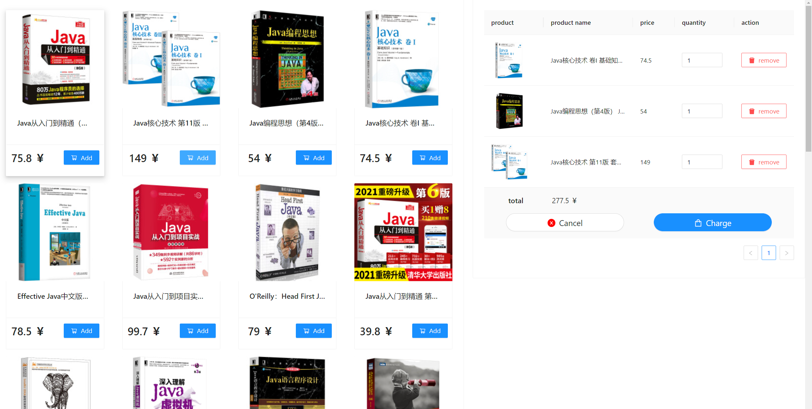
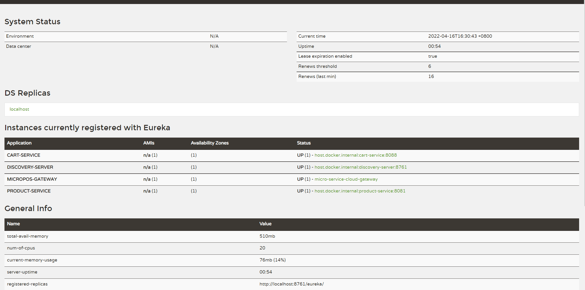
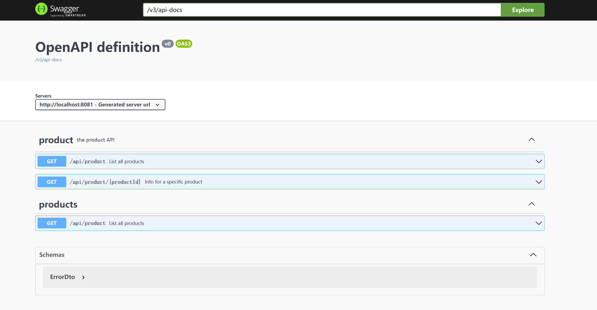
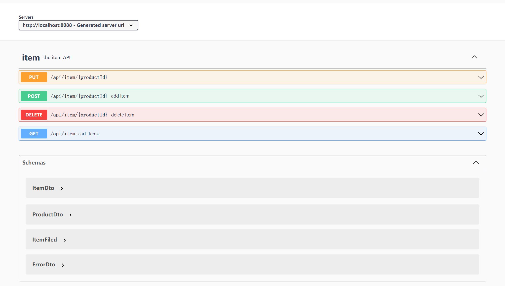
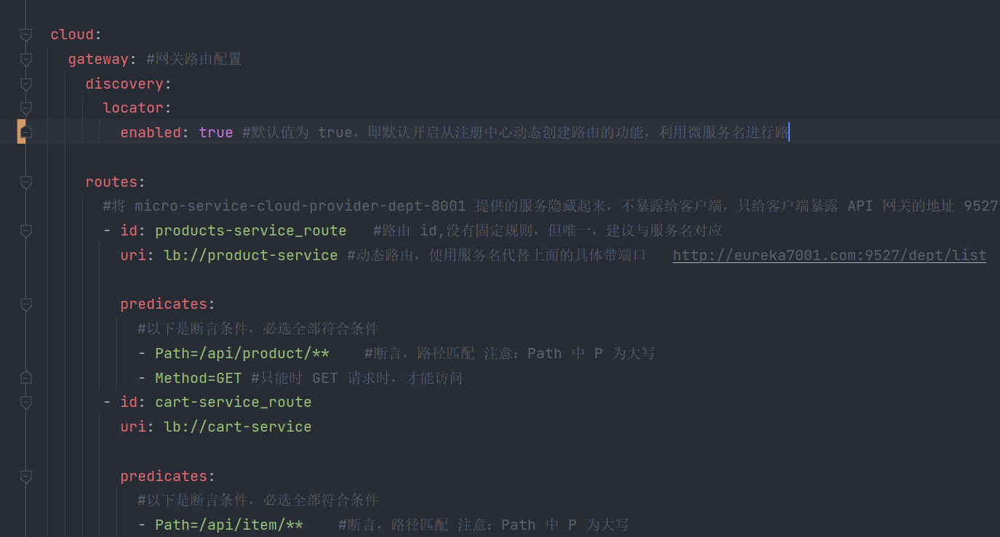

# RESTful microPoS 

## 综述
作业参考spring-petclinic-rest/spring-petclinic-microserivces 将aw04的webpos项目改为rest风格的微服务架。
并且使用react+antd+typescript开发出一个前端。下面做作业完成的界面

## 架构

### discovery-server
Erukea服务器，负责微服务之间信息管理，类似DNS服务器的功能。微服务可以在其上进行注册和拉取其他服务器信息。

### product-server
管理从JD爬取的商品信息，使用restful进行接口设计。对于product数据使用的ehcache管理机制进行缓存管理。

### Cart-server
服务购车部分进行，由于购物车主要是对于item资源进行操作，所以在资源对象建模时采用的是对item资源的建模而非cart
。由于在添加item时需要对product进行确认，所以在服务器中添加了熔断器机制

### Gateway-server
将微服务中负责将各个微服务进行封装，由其暴露出接口给客户，该服务器还负责路由的管理。前端打包的文件也放置于该服务器中。

### 前端部分
前端使用react框架，使用antd组件进行设计和实行。由于这部分不是课程的重点，所以不在这里详细描述。但是值得注意的时，由于
restful api的设计，通过openapi对应的代码生成工具，可以方便的生成ts的代码，实现前端与后端进行交互的部分。具体代码在https://github.com/ai-roboter-1/micropos-react.git.
